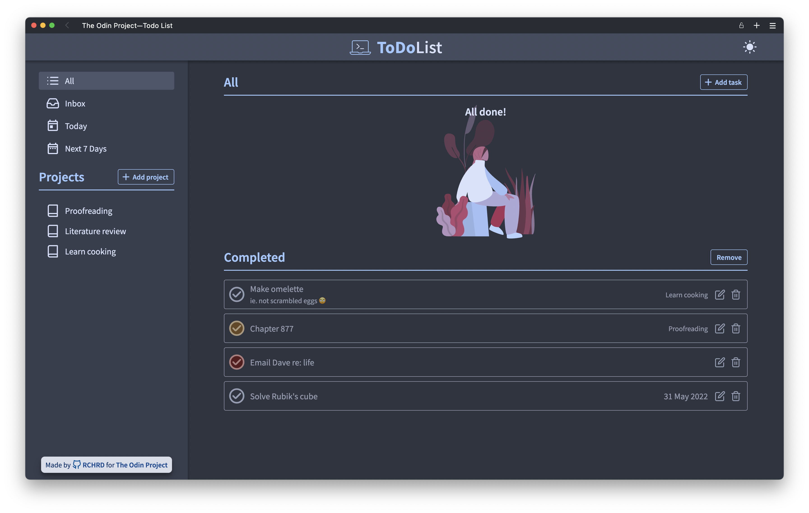

# todo-list

A HTML, CSS and Javascript project from The Odin Project's [curriculum](https://www.theodinproject.com/lessons/node-path-javascript-todo-list). Main focus:
* Webpack, ES6 Modules, Web Storage API

01/06/22: First release
29/08/22: Update — add responsive layout, night mode and modal slide out menus

Sources:
* Icons from [Feather](https://feathericons.com/), [Google Material Icons](https://fonts.google.com/icons?icon.set=Material+Icons) & [Glyphs.fyi](https://glyphs.fyi/)
* Illustrations from [Humaaans by Pablo Stanley](https://www.humaaans.com/)